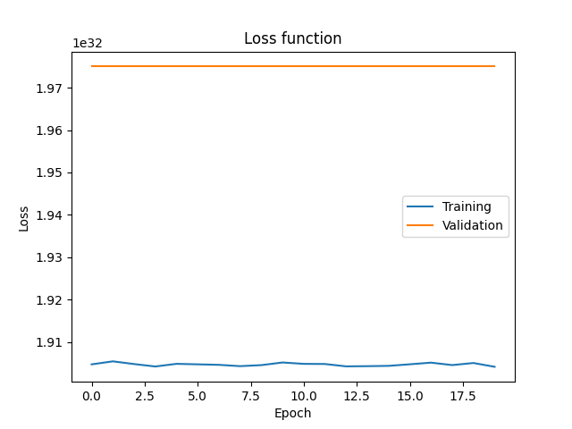
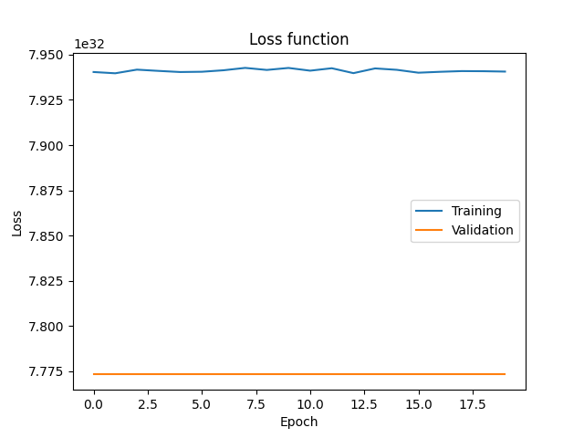
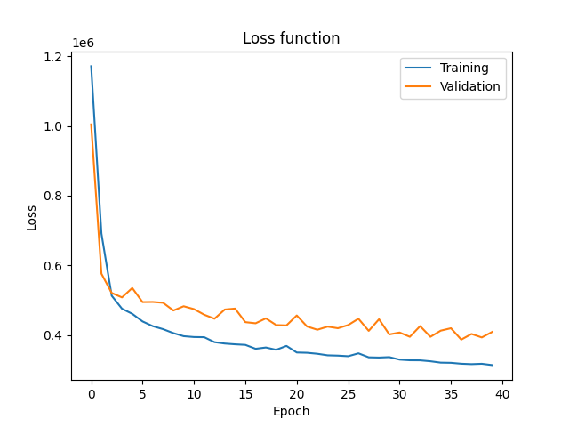

# Malakh Trainer

Tento skript trénuje modely neurónovej siete, ktoré sú využité v AI režime "ensemble" šachového enginu [Malakh](https://github.com/MS-101/Malakh).

## Analýza dat

**Dataset:** MvsFS

Tento dataset sme vytvorili simuláciou hier medzi šachovými enginami [Malakh](https://github.com/MS-101/Malakh) v AI režime "basic" a [Fairy Stockfish](https://github.com/fairy-stockfish/Fairy-Stockfish). Odsimulovali sme 500 hier pre konfiguráciu s červenými esenciami a 500 hier pre konfiguráciu s modrými esenciami. Pri simulácii bola hĺbka prehľadávania Malaka nastavená na 4 a hĺbka prehľadávania Fairy Stockfish nastavená na 6.

Tento dataset používame ako vstup do modelu neurónovej siete v 2 formách:

- **Bitboardy** - 12 bitboardov a 1 flag reprezentujúci hráča na rade
- **Obrázky** - 2 kanálový obrázok, 1. kanál obsahuje hodnoty 0-12 podľa figúrky na danej pozície, 2. kanál obsahuje hodnoty 0 ak je na rade biely hráč a hodnoty 1 ak je na rade čierny hráč

## Modely

### MLP

	class MLP(nn.Module):
	    def __init__(self, input_features, hidden_features, output_features, layers, activ):
	        super().__init__()
	
	        # input layer
	
	        self.input = nn.Sequential(
	            nn.Linear(input_features, hidden_features),
	            activ()
	        )
	
	        # hidden layer
	
	        hidden = []
	
	        for _ in range(layers):
	            hidden += [
	                nn.Linear(hidden_features, hidden_features),
	                activ()
	            ]
	
	        self.hidden = nn.Sequential(*hidden)
	
	        # output layer
	
	        self.output = nn.Linear(hidden_features, output_features)
	
	    def forward(self, x):
	        x = self.input(x)
	        x = self.hidden(x)
	        x = self.output(x)
	        return x

### CNN

	class CNN(nn.Module):
	    def __init__(self, conv_layers, conv_norm, conv_activ, fc_layers, fc_activ):
	        super().__init__()
	
	        # convolution layer
	
	        in_channels = 2
	        out_channels = 8
	
	        conv = []
	
	        for _ in range(conv_layers):
	            conv += [
	                nn.Conv2d(in_channels, out_channels, kernel_size=3, padding=1),
	                conv_norm(out_channels),
	                conv_activ(),
	                nn.MaxPool2d(kernel_size=2, stride=2),
	            ]
	
	            in_channels = out_channels
	            out_channels *= 2
	
	        self.conv = nn.Sequential(*conv)
	
	        # fully connected layer
	
	        dimension = int(8 / (2**conv_layers))
	        self.fc_input = in_channels * dimension * dimension
	
	        in_features = self.fc_input
	        out_features = int(in_features / 2)
	
	        fc = []
	
	        for _ in range(fc_layers):
	            fc += [
	                nn.Linear(in_features, out_features),
	                fc_activ()
	            ]
	
	            in_features = out_features
	            out_features = int(in_features / 2)
	
	        self.fc = nn.Sequential(*fc)
	
	        # output layer
	
	        self.output = nn.Linear(in_features, 1)
	
	    def forward(self, x):
	        x = self.conv(x)
	        x = x.view(-1, self.fc_input)
	        x = self.fc(x)
	        x = self.output(x)
	        return x

## Experimenty

V našich experimentoch porovnávame efektivitu 2 architektúr - MLP a CNN.

### MLP

V tomto experimente používame ako vstup bitboardový dataset MvsFS.

Skript:

	def mlp_experiment(input, output_dir, hidden_features, layers):
	    print()
	    print('Running MLP experiment on ' + input)
	    print()
	
	    # data config
	    datamodule = DataModuleBitboards(filename=input, ratio=0.8, batch_size=64)
	
	    # model config
	    model = MLP(
	        input_features=13,
	        hidden_features=hidden_features,
	        output_features=1,
	        layers=layers,
	        activ=nn.ReLU
	    )
	
	    # training config
	    criterion = nn.MSELoss()
	    optimizer = optim.Adam(model.parameters())
	    patience = 5
	    min_delta = 1000
	    max_epoch = 20
	
	    trainer = Trainer(
	        datamodule=datamodule,
	        model=model,
	        input_shape=(13,),
	        criterion=criterion,
	        optimizer=optimizer,
	        patience=patience,
	        min_delta=min_delta,
	        max_epoch=max_epoch,
	        output_dir=output_dir
	    )
	    trainer.fit()

Model:

	----------------------------------------------------------------
	        Layer (type)               Output Shape         Param #
	================================================================
	            Linear-1                   [-1, 50]             700
	              ReLU-2                   [-1, 50]               0
	            Linear-3                   [-1, 50]           2,550
	              ReLU-4                   [-1, 50]               0
	            Linear-5                   [-1, 50]           2,550
	              ReLU-6                   [-1, 50]               0
	            Linear-7                   [-1, 50]           2,550
	              ReLU-8                   [-1, 50]               0
	            Linear-9                    [-1, 1]              51
	================================================================
	Total params: 8,401
	Trainable params: 8,401
	Non-trainable params: 0
	----------------------------------------------------------------
	Input size (MB): 0.00
	Forward/backward pass size (MB): 0.00
	Params size (MB): 0.03
	Estimated Total Size (MB): 0.04
	----------------------------------------------------------------

### MLP (červená konfigurácia)

Epochy:

	Training epoch 0: loss = 1.90472931642728e+32
	Validation epoch 0: loss = 1.9750104008715014e+32
	Training epoch 1: loss = 1.9054388288970394e+32
	Validation epoch 1: loss = 1.9750104008715014e+32
	Training epoch 2: loss = 1.904800867930497e+32
	Validation epoch 2: loss = 1.9750104008715014e+32
	Training epoch 3: loss = 1.9042258282438815e+32
	Validation epoch 3: loss = 1.9750104008715014e+32
	Training epoch 4: loss = 1.90485104483893e+32
	Validation epoch 4: loss = 1.9750104008715014e+32
	Training epoch 5: loss = 1.904732547699251e+32
	Validation epoch 5: loss = 1.9750104008715014e+32
	Training epoch 6: loss = 1.9046149047361024e+32
	Validation epoch 6: loss = 1.9750104008715014e+32
	Training epoch 7: loss = 1.904304558604161e+32
	Validation epoch 7: loss = 1.9750104008715014e+32
	Training epoch 8: loss = 1.9045482806703724e+32
	Validation epoch 8: loss = 1.9750104008715014e+32
	Training epoch 9: loss = 1.9051708496851137e+32
	Validation epoch 9: loss = 1.9750104008715014e+32
	Training epoch 10: loss = 1.9048463536825545e+32
	Validation epoch 10: loss = 1.9750104008715014e+32
	Training epoch 11: loss = 1.9048093826997333e+32
	Validation epoch 11: loss = 1.9750104008715014e+32
	Training epoch 12: loss = 1.9042556657125494e+32
	Validation epoch 12: loss = 1.9750104008715014e+32
	Training epoch 13: loss = 1.9043011632590052e+32
	Validation epoch 13: loss = 1.9750104008715014e+32
	Training epoch 14: loss = 1.9043731215379128e+32
	Validation epoch 14: loss = 1.9750104008715014e+32
	Training epoch 15: loss = 1.904745761487795e+32
	Validation epoch 15: loss = 1.9750104008715014e+32
	Training epoch 16: loss = 1.905132378979032e+32
	Validation epoch 16: loss = 1.9750104008715014e+32
	Training epoch 17: loss = 1.9045577984876545e+32
	Validation epoch 17: loss = 1.9750104008715014e+32
	Training epoch 18: loss = 1.9050468841382154e+32
	Validation epoch 18: loss = 1.9750104008715014e+32
	Training epoch 19: loss = 1.9041531548312943e+32
	Validation epoch 19: loss = 1.9750104008715014e+32
	Testing epoch: loss = 1.8636968532456067e+32

Grafy:

Tento experiment bol neúspešný, náš model sa nebol schopný z datasetu nič naučiť.

### MLP (modrá konfigurácia)

Epochy:

	Training epoch 0: loss = 7.940418579345249e+32
	Validation epoch 0: loss = 7.773200283393608e+32
	Training epoch 1: loss = 7.939716498132673e+32
	Validation epoch 1: loss = 7.773200283393608e+32
	Training epoch 2: loss = 7.941731483531357e+32
	Validation epoch 2: loss = 7.773200283393608e+32
	Training epoch 3: loss = 7.941035476695973e+32
	Validation epoch 3: loss = 7.773200283393608e+32
	Training epoch 4: loss = 7.940410691251705e+32
	Validation epoch 4: loss = 7.773200283393608e+32
	Training epoch 5: loss = 7.94056163858136e+32
	Validation epoch 5: loss = 7.773200283393608e+32
	Training epoch 6: loss = 7.941383899994243e+32
	Validation epoch 6: loss = 7.773200283393608e+32
	Training epoch 7: loss = 7.942696897487146e+32
	Validation epoch 7: loss = 7.773200283393608e+32
	Training epoch 8: loss = 7.941564850176238e+32
	Validation epoch 8: loss = 7.773200283393608e+32
	Training epoch 9: loss = 7.942668815287034e+32
	Validation epoch 9: loss = 7.773200283393608e+32
	Training epoch 10: loss = 7.941162303694934e+32
	Validation epoch 10: loss = 7.773200283393608e+32
	Training epoch 11: loss = 7.942506304205149e+32
	Validation epoch 11: loss = 7.773200283393608e+32
	Training epoch 12: loss = 7.939796006005894e+32
	Validation epoch 12: loss = 7.773200283393608e+32
	Training epoch 13: loss = 7.942408861507866e+32
	Validation epoch 13: loss = 7.773200283393608e+32
	Training epoch 14: loss = 7.941633475751349e+32
	Validation epoch 14: loss = 7.773200283393608e+32
	Training epoch 15: loss = 7.940040347146964e+32
	Validation epoch 15: loss = 7.773200283393608e+32
	Training epoch 16: loss = 7.940536542198687e+32
	Validation epoch 16: loss = 7.773200283393608e+32
	Training epoch 17: loss = 7.940928671867466e+32
	Validation epoch 17: loss = 7.773200283393608e+32
	Training epoch 18: loss = 7.940864597357488e+32
	Validation epoch 18: loss = 7.773200283393608e+32
	Training epoch 19: loss = 7.940659436683177e+32
	Validation epoch 19: loss = 7.773200283393608e+32
	Testing epoch: loss = 7.808867031508187e+32

Grafy:

Tento experiment bol neúspešný, náš model sa nebol schopný z datasetu nič naučiť.

### CNN

V tomto experimente používame ako vstup obrázkový dataset MvsFS.

Skript:

	def cnn_experiment(input, output_dir, fc_layers):
	    print()
	    print('Running CNN experiment on ' + input)
	    print()
	
	    # data config
	    datamodule = DataModuleImages(filename=input, ratio=0.8, batch_size=64)
	
	    # model config
	    model = CNN(
	        conv_layers=2,
	        conv_norm=nn.InstanceNorm2d,
	        conv_activ=nn.ReLU,
	        fc_layers=fc_layers,
	        fc_activ=nn.ReLU
	    )
	
	    # training config
	    criterion = nn.MSELoss()
	    optimizer = optim.Adam(model.parameters(), lr = 0.01)
	    patience = 5
	    min_delta = 1000
	    max_epoch = 40
	
	    trainer = Trainer(
	        datamodule=datamodule,
	        model=model,
	        input_shape=(2, 8, 8),
	        criterion=criterion,
	        optimizer=optimizer,
	        patience=patience,
	        min_delta=min_delta,
	        max_epoch=max_epoch,
	        output_dir=output_dir
	    )
	    trainer.fit()

Model:

	----------------------------------------------------------------
	        Layer (type)               Output Shape         Param #
	================================================================
	            Conv2d-1              [-1, 8, 8, 8]             152
	    InstanceNorm2d-2              [-1, 8, 8, 8]               0
	              ReLU-3              [-1, 8, 8, 8]               0
	         MaxPool2d-4              [-1, 8, 4, 4]               0
	            Conv2d-5             [-1, 16, 4, 4]           1,168
	    InstanceNorm2d-6             [-1, 16, 4, 4]               0
	              ReLU-7             [-1, 16, 4, 4]               0
	         MaxPool2d-8             [-1, 16, 2, 2]               0
	            Linear-9                   [-1, 32]           2,080
	             ReLU-10                   [-1, 32]               0
	           Linear-11                   [-1, 16]             528
	             ReLU-12                   [-1, 16]               0
	           Linear-13                    [-1, 1]              17
	================================================================
	Total params: 3,945
	Trainable params: 3,945
	Non-trainable params: 0
	----------------------------------------------------------------
	Input size (MB): 0.00
	Forward/backward pass size (MB): 0.02
	Params size (MB): 0.02
	Estimated Total Size (MB): 0.04
	----------------------------------------------------------------

### CNN (červená konfigurácia)

Epochy:

	Training epoch 0: loss = 1171356.102303523
	Validation epoch 0: loss = 1004494.6569148937
	Training epoch 1: loss = 691271.8069952575
	Validation epoch 1: loss = 576143.1815159575
	Training epoch 2: loss = 512909.97095189703
	Validation epoch 2: loss = 520858.61502659577
	Training epoch 3: loss = 475655.8027608401
	Validation epoch 3: loss = 508181.7722739362
	Training epoch 4: loss = 460981.2947154472
	Validation epoch 4: loss = 535140.9115691489
	Training epoch 5: loss = 439180.56571815716
	Validation epoch 5: loss = 494645.0132978723
	Training epoch 6: loss = 425595.9488058943
	Validation epoch 6: loss = 495012.1216755319
	Training epoch 7: loss = 416984.10082147695
	Validation epoch 7: loss = 492684.1948138298
	Training epoch 8: loss = 405704.44821307587
	Validation epoch 8: loss = 470487.46875
	Training epoch 9: loss = 396877.8836382114
	Validation epoch 9: loss = 482729.57613031915
	Training epoch 10: loss = 394424.6049288618
	Validation epoch 10: loss = 474530.2300531915
	Training epoch 11: loss = 393953.75982384826
	Validation epoch 11: loss = 458439.2393617021
	Training epoch 12: loss = 379738.682376355
	Validation epoch 12: loss = 446930.9268617021
	Training epoch 13: loss = 375748.0460704607
	Validation epoch 13: loss = 473322.0425531915
	Training epoch 14: loss = 373565.0038533198
	Validation epoch 14: loss = 476040.8331117021
	Training epoch 15: loss = 371951.5392107046
	Validation epoch 15: loss = 437122.93484042556
	Training epoch 16: loss = 360747.03755928186
	Validation epoch 16: loss = 433886.22140957444
	Training epoch 17: loss = 364453.45401422767
	Validation epoch 17: loss = 447975.9920212766
	Training epoch 18: loss = 357802.2825203252
	Validation epoch 18: loss = 428728.39760638296
	Training epoch 19: loss = 368986.3016175474
	Validation epoch 19: loss = 427789.16090425535
	Training epoch 20: loss = 350056.27273882116
	Validation epoch 20: loss = 456297.0472074468
	Training epoch 21: loss = 349272.93631436315
	Validation epoch 21: loss = 424677.59175531915
	Training epoch 22: loss = 346425.51782689703
	Validation epoch 22: loss = 415318.6090425532
	Training epoch 23: loss = 342016.41514227644
	Validation epoch 23: loss = 424311.7147606383
	Training epoch 24: loss = 341167.49322493223
	Validation epoch 24: loss = 419675.296875
	Training epoch 25: loss = 339446.00639397016
	Validation epoch 25: loss = 428826.5066489362
	Training epoch 26: loss = 347738.80271849595
	Validation epoch 26: loss = 446993.61469414894
	Training epoch 27: loss = 336308.2914549458
	Validation epoch 27: loss = 412157.4597739362
	Training epoch 28: loss = 335659.759527439
	Validation epoch 28: loss = 445487.4960106383
	Training epoch 29: loss = 336887.7337398374
	Validation epoch 29: loss = 401923.2180851064
	Training epoch 30: loss = 329693.19126863143
	Validation epoch 30: loss = 407418.29055851063
	Training epoch 31: loss = 327813.23060636857
	Validation epoch 31: loss = 395121.07180851063
	Training epoch 32: loss = 327628.09286077233
	Validation epoch 32: loss = 425788.88696808513
	Training epoch 33: loss = 324975.4952574526
	Validation epoch 33: loss = 395129.4222074468
	Training epoch 34: loss = 321015.1088245257
	Validation epoch 34: loss = 412730.54089095746
	Training epoch 35: loss = 320505.673102981
	Validation epoch 35: loss = 419684.33078457444
	Training epoch 36: loss = 317871.5793953252
	Validation epoch 36: loss = 387078.375
	Training epoch 37: loss = 316673.2745596206
	Validation epoch 37: loss = 403230.1486037234
	Training epoch 38: loss = 317747.8490430217
	Validation epoch 38: loss = 393255.2632978723
	Training epoch 39: loss = 314031.9056571816
	Validation epoch 39: loss = 409006.8131648936
	Testing epoch: loss = 366685.1612367021

Grafy:

Tento experiment bol úspešný, naša sieť sa bola schopná naučiť evaluačnú funkciu.

### CNN (modrá konfigurácia)

Epochy:

	Training epoch 0: loss = 1200937.1854674798
	Validation epoch 0: loss = 874119.977393617
	Training epoch 1: loss = 632593.8972730353
	Validation epoch 1: loss = 568992.9886968085
	Training epoch 2: loss = 522088.6197493225
	Validation epoch 2: loss = 552268.7267287234
	Training epoch 3: loss = 483746.7442411924
	Validation epoch 3: loss = 519480.5551861702
	Training epoch 4: loss = 467093.0489075203
	Validation epoch 4: loss = 520421.045212766
	Training epoch 5: loss = 449297.1216124661
	Validation epoch 5: loss = 489039.65425531915
	Training epoch 6: loss = 437076.7243817751
	Validation epoch 6: loss = 491959.33776595746
	Training epoch 7: loss = 423320.55907012196
	Validation epoch 7: loss = 475174.06515957444
	Training epoch 8: loss = 413835.78036077233
	Validation epoch 8: loss = 455921.00199468085
	Training epoch 9: loss = 410585.993902439
	Validation epoch 9: loss = 446284.8460771277
	Training epoch 10: loss = 400922.4450796071
	Validation epoch 10: loss = 495440.4488031915
	Training epoch 11: loss = 392006.96688685636
	Validation epoch 11: loss = 434208.8051861702
	Training epoch 12: loss = 389739.13071646343
	Validation epoch 12: loss = 443943.1595744681
	Training epoch 13: loss = 389438.96235602984
	Validation epoch 13: loss = 415837.4574468085
	Training epoch 14: loss = 377138.6166158537
	Validation epoch 14: loss = 472628.3716755319
	Training epoch 15: loss = 375213.5900237127
	Validation epoch 15: loss = 432697.51861702127
	Training epoch 16: loss = 375912.70689363143
	Validation epoch 16: loss = 414885.48238031915
	Training epoch 17: loss = 367285.93131775066
	Validation epoch 17: loss = 450836.642287234
	Training epoch 18: loss = 369672.7417428862
	Validation epoch 18: loss = 418431.0947473404
	Training epoch 19: loss = 367621.96358401084
	Validation epoch 19: loss = 413498.4408244681
	Training epoch 20: loss = 362684.755123645
	Validation epoch 20: loss = 440497.5392287234
	Training epoch 21: loss = 360422.8006012873
	Validation epoch 21: loss = 412358.7426861702
	Training epoch 22: loss = 355267.25266768294
	Validation epoch 22: loss = 404143.71276595746
	Training epoch 23: loss = 354491.257325542
	Validation epoch 23: loss = 408576.77127659577
	Training epoch 24: loss = 349692.60230352305
	Validation epoch 24: loss = 401568.09640957444
	Training epoch 25: loss = 353885.5890074526
	Validation epoch 25: loss = 409691.48138297873
	Training epoch 26: loss = 348662.44186144986
	Validation epoch 26: loss = 408009.7277260638
	Training epoch 27: loss = 344593.9038363821
	Validation epoch 27: loss = 418607.3823138298
	Training epoch 28: loss = 345061.8403624661
	Validation epoch 28: loss = 393129.685837766
	Training epoch 29: loss = 343824.2483062331
	Validation epoch 29: loss = 400002.671875
	Training epoch 30: loss = 340638.07533028454
	Validation epoch 30: loss = 404121.3128324468
	Training epoch 31: loss = 335781.2932334011
	Validation epoch 31: loss = 397615.69348404254
	Training epoch 32: loss = 338268.65133807587
	Validation epoch 32: loss = 391316.5947473404
	Training epoch 33: loss = 336003.5206216125
	Validation epoch 33: loss = 408932.092087766
	Training epoch 34: loss = 336837.5792259485
	Validation epoch 34: loss = 395474.22007978725
	Training epoch 35: loss = 334684.27417852305
	Validation epoch 35: loss = 389433.7104388298
	Training epoch 36: loss = 326876.41277100274
	Validation epoch 36: loss = 397384.28723404254
	Training epoch 37: loss = 330412.77621104335
	Validation epoch 37: loss = 416925.04055851063
	Training epoch 38: loss = 328951.7740091463
	Validation epoch 38: loss = 397269.1299867021
	Training epoch 39: loss = 326909.1383807588
	Validation epoch 39: loss = 392788.70013297873
	Testing epoch: loss = 375804.1323138298

Grafy:

Tento experiment bol úspešný, naša sieť sa bola schopná naučiť evaluačnú funkciu.

## Vyhodnotenie

Z našich experimentov sme zistili, že MLP architektúra nie je vhodná pre evaluáciu šachových pozícií. CNN architektúra je efektívna na evaluáciu šachových pozícií. 
